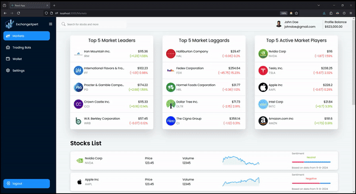
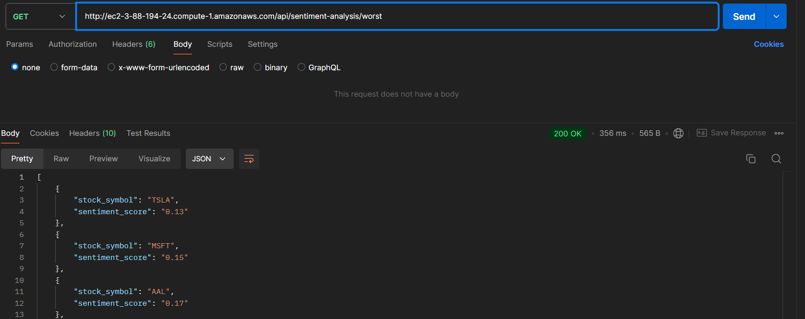

<br><br>

<!-- project philosophy -->


> ExchangeXpert is a cutting-edge website platform designed to empower investors with AI-driven insights and tools. By analyzing stock news and using advanced machine learning algorithms.
>
> ExchangeXpert provides personalized stock recommendations, helping users make informed investment decisions.
>
> The aim of the ExchangeXpert project is to provide investors with a powerful, AI-driven platform that simplifies the process of stock trading and investment. By leveraging cutting-edge artificial intelligence and machine learning technologies.

### User Roles

#### Admin

- As an admin, I want to view a list of all user accounts, so I can monitor user activity and manage the platform effectively.
- As an admin, I want to monitor all trading strategies for users.

#### Normal User

- As a user, I want to view recommended stocks, so I can easily find investment opportunities.
- As a user, I want to set up automated trading strategies, so I can take advantage of market opportunities without constant monitoring.
- As a user, I want to view long term forcast for a stock, so I can make a decision to buy for the long term.

<br><br>

<!-- Tech stack -->


### ExchangeXpert is built using the following technologies:

- This project uses the [React library](https://reactjs.org/) for building user interfaces. React allows us to develop efficient and scalable front-end applications with its component-based architecture, making it ideal for real-time data updates and complex UI designs.
- [Laravel](https://laravel.com/) serves as the backend framework, handling API requests, authentication, and server-side logic. It ensures the application is secure, scalable, and maintainable.
- [MySQL](https://dev.mysql.com/doc/) A reliable, high-performance relational database used for storing user information, trading data, and historical stock data. It ensures data consistency and supports complex querying.
- [Prophet](https://facebook.github.io/prophet/) Prophet, initially developed by Facebook, is used for stock price forecasting. It provides a robust statistical model that supports both daily and long-term stock predictions.
- [Python](https://www.python.org/) Powers the backend trading bots, integrating with APIs like Alpaca to automate stock trading operations. Python's rich ecosystem for financial analysis and automation makes it ideal for building complex trading algorithms.
- [Alpaca](https://alpaca.markets/) Integrated as the broker for real-time stock data and executing buy/sell orders. Alpaca offers commission-free trading and a robust API that facilitates both paper trading and live trading. ExchangeXpert leverages Alpaca to fetch stock market data, manage portfolios, and automate trades through its trading bots.

<br><br>

<!-- UI UX -->


> We designed Coffee Express using wireframes and mockups, iterating on the design until we reached the ideal layout for easy navigation and a seamless user experience.

- Project Figma design [figma](https://www.figma.com/file/LsuOx5Wnh5YTGSEtrgvz4l/Purrfect-Pals?type=design&node-id=257%3A79&mode=design&t=adzbABt5hbb91ucZ-1)

### Mockups

| Markets screen                          | Stock Screen                                             | Login Screen                 |
| --------------------------------------- | -------------------------------------------------------- | ---------------------------- |
|  |  |  |

<br><br>

<!-- Database Design -->


### Architecting Data Excellence: Innovative Database Design Strategies:

- Insert ER Diagram here
  

<br><br>

<!-- Implementation -->


| Markets screen                          | Stock Screen                                             |  Screen                 |
| --------------------------------------- | -------------------------------------------------------- | ---------------------------- |
|  |  |  |
<br><br>

<!-- Prompt Engineering -->


### Mastering AI Interaction: Unveiling the Power of Transformers for Sentiment Analysis:

- This project leverages advanced transformer models to perform sentiment analysis on stock news. By carefully designing how we interact with the models, we are able to recommend stocks based on the news sentiment, providing accurate and helpful insights for decision-making.

<br><br>

<!-- AWS Deployment -->


### Efficient AI Deployment: Unleashing the Potential with AWS Integration:

- This project leverages AWS deployment strategies to seamlessly integrate and deploy natural language processing models. The backend server runs on an EC2 instance. 

<br><br>



<!-- Unit Testing -->


### Precision in Development: Harnessing the Power of Unit Testing:

- This project employs rigorous unit testing methodologies to ensure the reliability and accuracy of code components. By systematically evaluating individual units of the software, we guarantee a robust foundation, identifying and addressing potential issues early in the development process.
  <br><br>
  
  
  

<!-- How to run -->


> To set up Coffee Express locally, follow these steps:

### Prerequisites

Ensure that you have the following installed on your machine:

- Laravel: [Install Laravel](https://laravel.com/docs/10.x/installation)
- React: [Install React](https://react.dev/learn/installation)
- Python: [Install Python](https://www.python.org/downloads/)
- Transformers : [Install Transformers](https://huggingface.co/docs/transformers/en/installation)
<!-- - Prophet : [Install Prophet](https://facebook.github.io/prophet/docs/installation.html) -->

## Installation Guide

### 1. Clone the Repository

```bash
git clone https://github.com/abdallah-al-khaled/ExchangeXpert
cd ExchangeXpert
```

### 2. Frontend (React.js) Setup

- Navigate to the frontend project directory.
- Create a .env file in the root and add the following

```bash
REACT_APP_APCA_API_KEY_ID="YOUR_ALPACA_API_KEY"
REACT_APP_APCA_API_SECRET_KEY="YOUR_ALPACA_API_SECRET"
```

- Install dependencies and run the React frontend

```bash
npm install
npm start
```

### 3. Laravel Backend Setup
- Navigate to the Laravel backend directory.
- Install Laravel dependencies:
```bash
composer install
```
- Migrate the database.
```bash
php artisan migrate
```
- Start the Laravel development server:
```bash
php artisan serve
```

### 4. Python Bots and Machine Learning Setup
- Navigate to the services directory
- Install the required Python dependencies:
```bash
pip install -r requirements.txt
```
- Start the bot service:
```bash
python RSI_bot.py && python MACD_bot.py
```
- To enable the prediction models, start the forecasting model:
```bash
python run_forecast.py
```
